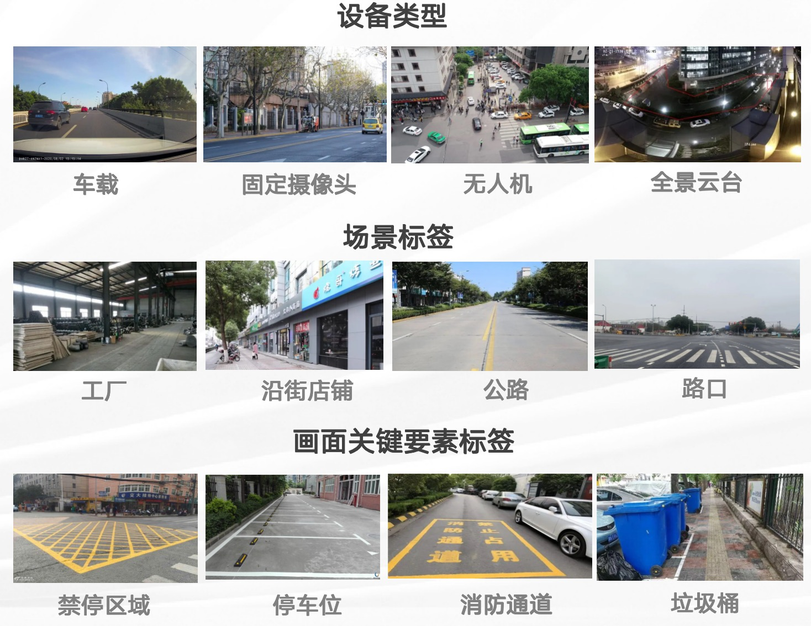
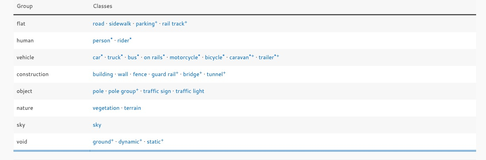
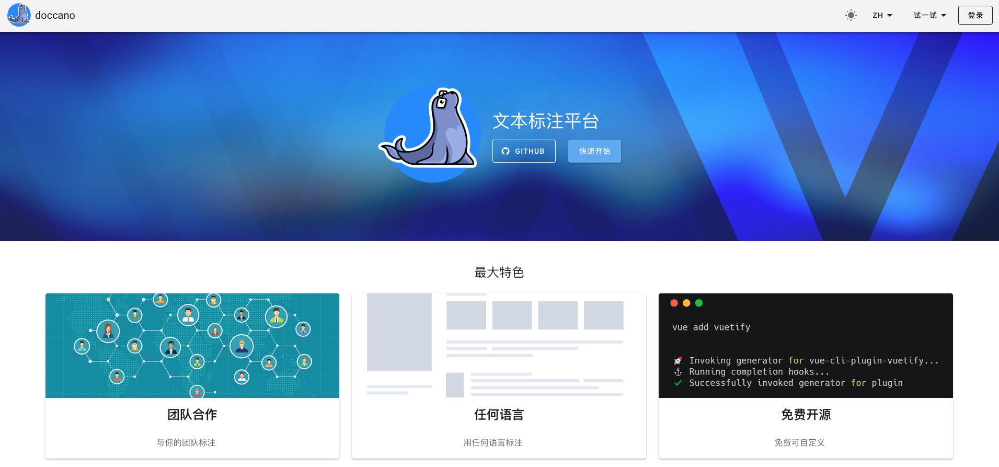
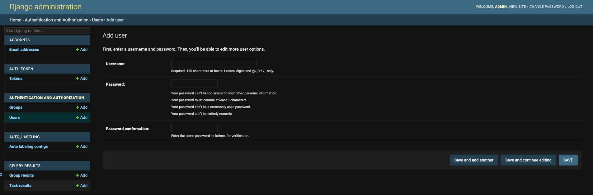
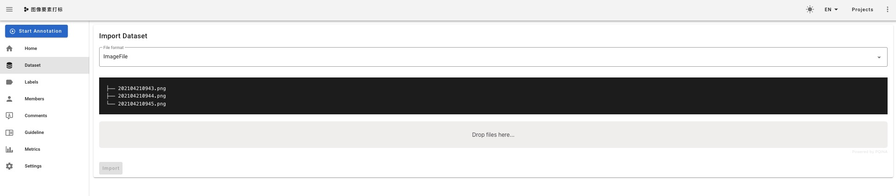
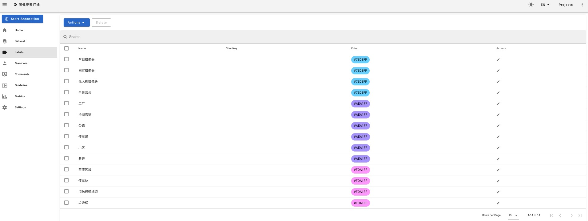
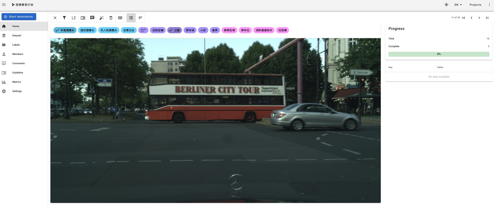
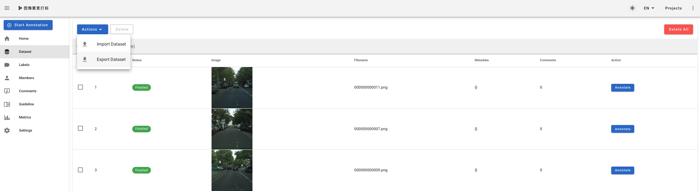
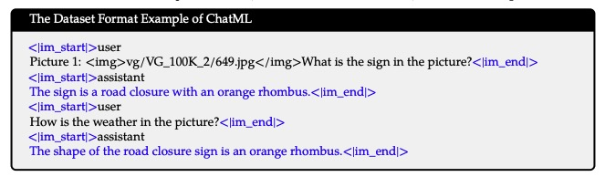

# 基于多模态大模型的图像要素分析

## 任务背景

图像处理和内容理解应用需求在ToB和ToG的项目中非常常见，例如“智慧城市”、“数字政府”等我们经常能听到的一些工程项目中就需要依赖算法能力，对图像和视频进行结构化分析。

在大模型技术爆发之前，承接这类需求的方法是来一个任务就训练一个模型，例如识别街面上的垃圾桶、公交站台、停车位等等。或者自动判断摄像头拍摄的画面属于什么场景，例如停车场、小区、沿街店铺、公路等等。
这类技术方案的问题是落地成本比较大，如果客户需要识别的目标类别非常多，我们的标注任务就会异常艰巨。

自动多模态大模型技术得到充分发展后，大家纷纷使用VLM代替以往的“小模型”，并且尽可能尝试用一个VLM处理所有的视觉内容理解任务，这也是我们要去验证的技术路径，并且根据现有的经验，大模型需要的训练样本远比小模型来得少，这也得益于大模型超强的泛化能力。

## 任务定义

真实的城市业务标签体系：
- 设备类型：车载摄像头、固定摄像头、无人机航拍摄像头、全景云台...
- 场景标签：工厂、沿街店铺、公路、路口、停车场、小区、巷弄...
- 画面关键要素标签：禁停区域、停车位、消防通道标识、垃圾桶...



我们的任务就是通过多模态内容理解大模型，为每一张图像打上合适的上述标签。


## 数据准备

首先我们需要选择一个图像数据集，为了贴合真实的业务场景，我们选择CityScapes这个开源数据集。这是一个语义分割和分类的数据集，大多数都是街景图，很适合用来做智慧城市相关业务的基础数据集。

- 官方网站：https://www.cityscapes-dataset.com/downloads/
- modelscope数据链接：https://modelscope.cn/datasets/OpenDataLab/CityScapes


以下是Cityscapes数据集的主要特点：
- 场景多样性：Cityscapes数据集涵盖了来自德国和其他欧洲城市的街景图像。数据集中包含各种不同的城市场景，包括城市街道、交通标志、行人、车辆等。

- 大规模高分辨率图像：Cityscapes数据集提供了大量高分辨率的图像样本。图像的分辨率为1024x2048像素，捕捉了细节丰富的城市场景。

- 详细的标注信息：Cityscapes数据集提供了精确的标注信息，包括语义分割、实例分割和像素级标注。语义分割标注将图像中的每个像素分配到不同的类别，实例分割标注进一步将每个目标实例分割出来，而像素级标注提供了每个像素的细粒度标注。

- 多任务学习：Cityscapes数据集支持多任务学习，包括语义分割、实例分割和像素级标注。这使得研究人员可以同时进行不同的场景理解任务，提高模型的多样性和鲁棒性。

- 评估标准：Cityscapes数据集使用交并比和交并比分数作为语义分割和实例分割任务的主要评估指标。这些评估指标可以量化模型在像素级别和目标级别上的准确性和完整性。

```
- cityscapes
  - gtFine
    - train
      - 城市名称
        - gtFine_labelIds.png (语义分割标注，每个像素的类别标签)
        - gtFine_instanceIds.png (实例分割标注，每个像素的实例标签)
        - gtFine_polygons.json (实例分割标注，每个实例的多边形边界)
    - val
      - 城市名称
        - gtFine_labelIds.png
        - gtFine_instanceIds.png
        - gtFine_polygons.json
    - test
      - 城市名称
        - gtFine_labelIds.png
        - gtFine_instanceIds.png
        - gtFine_polygons.json
  - leftImg8bit
    - train
      - 城市名称
        - 城市名称_图像编号_leftImg8bit.png (原始图像)
    - val
      - 城市名称
        - 城市名称_图像编号_leftImg8bit.png
    - test
      - 城市名称
        - 城市名称_图像编号_leftImg8bit.png
```



我们的任务不需要所有数据，只需要原始未标注数据（leftImg8bit）即可，我们也可以保留每张图像的中的语义类别，这样对选择哪些原始图像进行标注有一定的指导作用

## 数据标注

在真实的业务场景中，标数据是非常常见的一个步骤，因为客户提出的识别目标可能是带有严格业务语义的，所以我们必须要为其补充训练样本，所以掌握标注系统的使用方法是算法工程师的必备技能。

今天我们就使用[doccano](https://github.com/doccano/doccano)搭建一个标注平台，并且在城市图像数据上进行标注。

### 部署标注平台

通过docker在本地启动doccano：
```
# 拉docker镜像到本地
docker pull doccano/doccano

# 创建容器
docker container create --name doccano \
  -e "ADMIN_USERNAME=admin" \
  -e "ADMIN_EMAIL=admin@example.com" \
  -e "ADMIN_PASSWORD=123456" \
  -v /path/to/doccano/data:/data \
  -p 8000:8000 doccano/doccano

# 启动容器
docker container start doccano

# 关闭容器
docker container stop doccano -t 5
```

容器启动后，在浏览器访问：`http://127.0.0.1:8000/`打开标注平台页面



### 登录&注册账号

管理员账户是我们创建容器时候设定的，例如我刚设定的账号是：
- 账户名：admin
- 密码：123456

除此之外，我们还可以为其它用户创建账号，让所有标注员都用这个平台进行标注和数据管理。
- 首先登录：http://127.0.0.1:8000/admin/auth/user/add
- 在页面中输入你要创建的账户名称和密码
    

### 创建标注任务

在标注页面创建`Image Classification`标注任务。大家要学会将自己的标注任何和已有的通用任务进行关联，寻找到满足自己任务标注要求的方法进行标注。

1. 导入数据：进入项目，点击左侧导航栏`Dataset`，选择`Import Dataset`，然后选择预先存储待标注图像的文件夹，点击左下角`Import`
    
2. 创建标签：点击左侧导航栏`Label`，选择`Create Label`。因为标签数量比较少，我们可以在页面上直接创建，如果标签数量非常多，大家可以尝试用文件的形式导入。这里我们注意，因为我们做的其实是一个多标签任务，并且我们的标签体系是分为3个group的，为了标注时候方便区分，我们将同一个group的标签设置为相同颜色。
    
3. 添加标注员：如果我们有多位标注员能参与该标注任务，可以通过导航栏的`Members`来添加标注员，并未他们分配权限，一般普通标注员只有标注权限

### 进行标注

进入每一张的标注页面，观察图像内容，在上侧的标签中选择合适进行点击。被选择的标签前将出现一个✅，代表当前图片被打上了该标签。



### 标注结果导出

所有数据标注完成后，我们在项目页面上就能看到图像的状态就变成了`Finish`，这时我们就能把数据道导出了。通过点击左侧导航栏的`Dataset`中的`Export`来实现。



导出的内容是每位标注员的标注结果，以jsonl的格式存储：
```
{"id":1,"filename":"000000000011.png","label":["无人机摄像头","消防通道标识"],"Comments":[]}
{"id":2,"filename":"000000000007.png","label":["工厂","禁停区域"],"Comments":[]}
{"id":3,"filename":"000000000009.png","label":["沿街店铺","禁停区域"],"Comments":[]}
{"id":4,"filename":"000000000014.png","label":["无人机摄像头","沿街店铺","禁停区域"],"Comments":[]}
{"id":5,"filename":"000000000006.png","label":["停车场","固定摄像头","垃圾桶"],"Comments":[]}
{"id":6,"filename":"000000000012.png","label":["全景云台","公路","消防通道标识"],"Comments":[]}
{"id":7,"filename":"000000000010.png","label":["小区","无人机摄像头","禁停区域"],"Comments":[]}
{"id":8,"filename":"000000000013.png","label":["全景云台","垃圾桶","小区"],"Comments":[]}
{"id":9,"filename":"000000000004.png","label":["巷弄","无人机摄像头"],"Comments":[]}
{"id":10,"filename":"000000000002.png","label":["小区","无人机摄像头","沿街店铺","消防通道标识"],"Comments":[]}
{"id":11,"filename":"000000000016.png","label":["公路","车载摄像头"],"Comments":[]}
{"id":12,"filename":"000000000005.png","label":["公路","车载摄像头"],"Comments":[]}
{"id":13,"filename":"000000000003.png","label":["公路","车载摄像头"],"Comments":[]}
{"id":14,"filename":"000000000001.png","label":["沿街店铺","车载摄像头"],"Comments":[]}
{"id":15,"filename":"000000000008.png","label":["公路","车载摄像头"],"Comments":[]}
{"id":16,"filename":"000000000017.png","label":["公路","车载摄像头"],"Comments":[]}
{"id":17,"filename":"000000000015.png","label":["停车位","无人机摄像头"],"Comments":[]}
{"id":18,"filename":"000000000000.png","label":["小区","无人机摄像头","消防通道标识"],"Comments":[]}
```

## 城市图像结构化大模型方案

我们的目标是用多模态大模型在已经定义好的标签体系上进行打标，做直接的方法就是为每一类标签都训练一个对应的模型。我们现在有三类标签，那就要训练三个模型。那如果客户的标签体系中有10类标签呢？我们也要训练和部署10个模型吗？客户肯定跳脚，还不如用小模型来做，大模型的优势就提现不出来了。所以我们要做的是训练一个模型，能处理所有类型的打标任务。

### 1、通过Prompt处理多标签任务

打标签也就是分类，但当前任务不是简单的多分类，因为除了摄像头的类别外，其余两类标签都是非互斥的，所以是一个典型的多标签任务。我们以前讲过，多标签任务可以转化为二分类来处理，也就是让大模型逐个判断图像画面中是否包含某个元素，prompt设计如下：
```python
prompt_template = """设你是一位城市管理者，非常擅长分辨图像中的关键要素。
请你仔细观察提供给你的这张图像，判断画面中是否包含<element_tag>
"""
```

这里的`element_tag`可以替换成停车位、垃圾桶等具体的要素标签。这是一种可行的问题转化策略，但无形中扩大了推理成本，把原来一个推理请求复制了N次，在密集型推理场景中相当于一直在做压测，所以这并不是一种最优解。那能否让大模型直接处理多标签任务呢？

```python
prompt_template = """你是一位图像画面场景分析智能助手，你的工作是在用户给出的图像要素范围中，挑选出画面中真实出现的所有要素内容，在规定范围之外的要素内容不需要判断。
要素标签如下：{element_tags} 。
请你结合图像中画面和文字信息，挑选画面中出现的要素标签：
"""
```

### 2、基于对话模板的多任务合并处理策略

我们已经可以根据上面的Prompt Engineering策略为每一类标签都设计一个Prompt模板，然后将每张图像的标注结果转化成3条微调训练样本：

```python
device_type_prompt_template = """你是一位城市管理者，同时非常了解城市中用于拍摄实时画面的摄像头设备，可以根据设备拍摄画面的角度、内容等信息判断拍摄该图像的设备属于以下哪一种：车载摄像头、固定摄像头、无人机、全景云台。
请根据当前图像直接说出属于哪一类摄像头，不要对答案进行解释，不能拒答。
拍摄该图像的摄像头类型为：
"""

element_prompt_template = """你是一位图像画面场景分析智能助手，你的工作是在用户给出的图像要素范围中，挑选出画面中真实出现的所有要素内容，在规定范围之外的要素内容不需要判断。
要素标签如下：{element_tags} 。
请你结合图像中画面和文字信息，挑选画面中出现的要素标签：
"""

scene_prompt_template = """你是一位城市管理者，擅长分析图像的主要内容。
请你仔细分析图像画面内容，判断画面中主要展现的场景有哪些，并将场景从给定的标签范围中挑选出来。
场景标签有：{scene_tags}.
请你结合图像中画面和文字信息，挑选画面中的场景标签：
"""
```

我们自己去标完一定量的数据之后就会发现这些标签之间并不是毫无联系的。比如说停车场中必有停车位、沿街店铺前或者公路边也有概率出现停车位，类似的还有小区门口一般会画上禁停黄线、消防通道标识。所以标签之间是有内在联系的，这种关系在分类任务中是非常有用的。那我们能否在大模型的训练任务中也让这类联系发挥正向作用，让模型学习到呢？这就要用到我们之前说的VLM的对话模板了。



虽然我们做的是一个打标任务，但由于用的是模型是生成式的大模型，所以训练语料格式其实就是简单的QA，我们按照多轮对话的方式把上面三个打标任务按顺序组合在一起不就完事了吗？按照这个设计，我们可以先让大模型判断设备类别、再分析场景、最后识别画面要素

```text
<|im_start|>user
Picture 1:  {image path} </img>你是一位城市管理者，同时非常了解城市中用于拍摄实时画面的摄像头设备，可以根据设备拍摄画面的角度、内容等信息判断拍摄该图像的设备属于以下哪一种：车载摄像头、固定摄像头、无人机、全景云台。
请根据当前图像直接说出属于哪一类摄像头，不要对答案进行解释，不能拒答。
拍摄该图像的摄像头类型为：<|im_end|>
<|im_start|>assistant
车载摄像头<|im_end|>
<|im_start|>user
你同样擅长分析图像的主要内容。
请你仔细分析图像画面内容，判断画面中主要展现的场景有哪些，并将场景从给定的标签范围中挑选出来。
场景标签有：{scene_tags}.
请你结合图像中画面和文字信息，挑选画面中的场景标签：<|im_end|>
<|im_start|>assistant
沿街店铺<|im_end|>
<|im_start|>user
你的工作是在用户给出的图像要素范围中，挑选出画面中真实出现的所有要素内容，在规定范围之外的要素内容不需要判断。
要素标签如下：{element_tags} 。
请你结合图像中画面和文字信息，挑选画面中出现的要素标签：<|im_end|>
<|im_start|>assistant
停车位、垃圾桶<|im_end|>
```

这就能保证大模型在回答下面的问题时，能感知到前面已经做出的判断，完美做到了在不同种类标签之间进行关联。

### 3、生成式任务多标签任务优化策略 --- 标签依赖固化问题

在使用生成式模型处理多标签任务时，在构造训练数据集时需要注意避免把标签的先后循序定死。例如在答案中，如果一张图像中同时出现了停车位和垃圾桶，那么垃圾桶这个标签永远在停车位后面。这种现象一般是由数据处理脚本导致的，这就容易给大模型一种暗示，就是只有当出现停车位时才会同时存在垃圾桶！这种暗示是绝对错误的，是对模型的误导，那如何避免呢？ --- **Seq2Set**

我们在准备训练数据集的时候，遇到答案是多标签的情况，我们穷举这些标签的组合方式，例如一张图像中存在 垃圾桶、停车位、消防通道三个要素，那我们就需要将其所有组合罗列出来：
```
垃圾桶、停车位、消防通道
垃圾桶、消防通道、停车位
停车位、消防通道、垃圾桶
停车位、垃圾桶、消防通道
消防通道、垃圾桶、停车位
消防通道、停车位、垃圾桶
```
所以原本一条训练数据就被扩展为了6条，通过这种方法能有效降低这种“错误暗示”对模型的影响

## 微调QwenVL

### 环境准备

```
conda create -n qwen_vl python==3.10 -y
conda activate qwen_vl

git clone https://github.com/QwenLM/Qwen-VL.git
cd Qwen-VL/

pip install -r requirements.txt -i https://pypi.tuna.tsinghua.edu.cn/simple
pip install deepspeed -i https://pypi.tuna.tsinghua.edu.cn/simple
pip install peft -i https://pypi.tuna.tsinghua.edu.cn/simple
```

### 模型下载

从ModelScope上下载模型：
```shell
pip install modelscope
modelscope download --model qwen/Qwen-VL-Chat --local_dir <你自己指定的目录>
```


### 数据准备

首先将标注好的结果连同原图，按照上述方案处理成多轮对话格式：
```json
[
  {
    "id": "identity_0",
    "conversations": [
      {
        "from": "user",
        "value": "你好"
      },
      {
        "from": "assistant",
        "value": "我是Qwen-VL,一个支持视觉输入的大模型。"
      }
    ]
  },
  {
    "id": "identity_1",
    "conversations": [
      {
        "from": "user",
        "value": "Picture 1: https://qianwen-res.oss-cn-beijing.aliyuncs.com/Qwen-VL/assets/demo.jpeg</img>\n图中的狗是什么品种？"
      },
      {
        "from": "assistant",
        "value": "车载摄像头"
      },
      {
        "from": "user",
        "value": "框出图中的格子衬衫"
      },
      {
        "from": "assistant",
        "value": "沿街店铺"
      }
    ]
  },
  {
    "id": "identity_2",
    "conversations": [
      {
        "from": "user",
        "value": "Picture 1:  {image path} </img>你是一位城市管理者，同时非常了解城市中用于拍摄实时画面的摄像头设备，可以根据设备拍摄画面的角度、内容等信息判断拍摄该图像的设备属于以下哪一种：车载摄像头、固定摄像头、无人机、全景云台。\n请根据当前图像直接说出属于哪一类摄像头，不要对答案进行解释，不能拒答。\n拍摄该图像的摄像头类型为："
      },
      {
        "from": "assistant",
        "value": "车载摄像头"
      },
      {
        "from": "user",
        "value": "你同样擅长分析图像的主要内容。\n请你仔细分析图像画面内容，判断画面中主要展现的场景有哪些，并将场景从给定的标签范围中挑选出来。\n场景标签有：{scene_tags}.\n请你结合图像中画面和文字信息，挑选画面中的场景标签："
      },
      {
        "from": "assistant",
        "value": "沿街店铺"
      },
      {
        "from": "user",
        "value": "你的工作是在用户给出的图像要素范围中，挑选出画面中真实出现的所有要素内容，在规定范围之外的要素内容不需要判断。\n要素标签如下：{element_tags} 。\n请你结合图像中画面和文字信息，挑选画面中出现的要素标签："
      },
      {
        "from": "assistant",
        "value": "停车位、垃圾桶"
      }
    ]
  }
]
```

### 微调

我们选择单卡（4090）LoRA微调QwenVL，在启动微调之前，需要修改下原脚本 `finetune/finetune_lora_single_gpu.sh`:
```shell
#!/bin/bash
export CUDA_DEVICE_MAX_CONNECTIONS=1
DIR=`pwd`
export NCCL_P2P_DISABLE="1"
export NCCL_IB_DISABLE="1"
MODEL=""        # 这里改成模型的保存路径

DATA="your_data_path.json"

export CUDA_VISIBLE_DEVICES=0

python finetune.py \
    --model_name_or_path $MODEL \
    --data_path $DATA \
    --bf16 True \
    --fix_vit True \
    --output_dir output_qwen \
    --num_train_epochs 25 \
    --per_device_train_batch_size 2 \
    --per_device_eval_batch_size 1 \
    --gradient_accumulation_steps 8 \
    --evaluation_strategy "no" \
    --save_strategy "steps" \
    --save_steps 1000 \
    --save_total_limit 10 \
    --learning_rate 1e-3 \
    --weight_decay 1e-3 \
    --adam_beta2 0.95 \
    --warmup_ratio 0.01 \
    --lr_scheduler_type "cosine" \
    --logging_steps 1 \
    --report_to "none" \
    --model_max_length 1024 \
    --lazy_preprocess True \
    --gradient_checkpointing \
    --use_lora
```
- 这里修改脚本里的model_max_length参数，默认是2048（需要27.3GB的显存），调小
- MODEL和DATA改为自己的模型地址和数据集地址


启动微调训练
```
nohup ./finetune_lora_single_gpu.sh > train.log 2>&1 &
```
- 模型训练完会保存在output_qwen文件中，如果想要修改保存路径，需要在上面的shell脚本中修改


### 合并模型

```python
from peft import AutoPeftModelForCausalLM

model = AutoPeftModelForCausalLM.from_pretrained(
    path_to_adapter, # 将这里改为输出新模型的路径
    device_map="auto",
    trust_remote_code=True
).eval()

merged_model = model.merge_and_unload()
# max_shard_size and safe serialization are not necessary. 
# They respectively work for sharding checkpoint and save the model to safetensors
merged_model.save_pretrained(new_model_directory, max_shard_size="2048MB", safe_serialization=True)

```

- new_model_directory 为合并后的新模型的存放位置

## 推理

```python
from transformers import AutoTokenizer, AutoModelForCausalLM
import torch
from transformers import AutoModelForCausalLM, AutoTokenizer
from transformers.generation import GenerationConfig
import torch
torch.manual_seed(1234)
# 加载合并后的模型和tokenizer
tokenizer = AutoTokenizer.from_pretrained("/qwen-vl/new_model/", trust_remote_code=True)
# 默认gpu进行推理，需要约24GB显存
model = AutoModelForCausalLM.from_pretrained("/qwen-vl/new_model/", device_map="cuda", trust_remote_code=True).eval()

# 可指定不同的生成长度、top_p等相关超参（transformers 4.32.0及以上无需执行此操作）
# model.generation_config = GenerationConfig.from_pretrained("Qwen/Qwen-VL", trust_remote_code=True)

query = tokenizer.from_list_format([
    {'image': '/qwen-vl/dewarping_test1.png'}, # Either a local path or an url
    {'text': 'Provide the OCR results of this picture.'},
])
inputs = tokenizer(query, return_tensors='pt')
inputs = inputs.to(model.device)
pred = model.generate(**inputs)
response = tokenizer.decode(pred.cpu()[0], skip_special_tokens=False)
print(response)

image = tokenizer.draw_bbox_on_latest_picture(response)
if image:
  image.save('2.jpg')
else:
  print("no box")
```

## Demo

```
pip install -r requirements_web_demo.txt

python web_demo_mm.py --checkpoint-path <new_model_directory>
```

- new_model_directory：上面训练后合并完的新目录
- 访问`http://127.0.0.1:8000`访问demo
