# 多模态大模型能做什么？

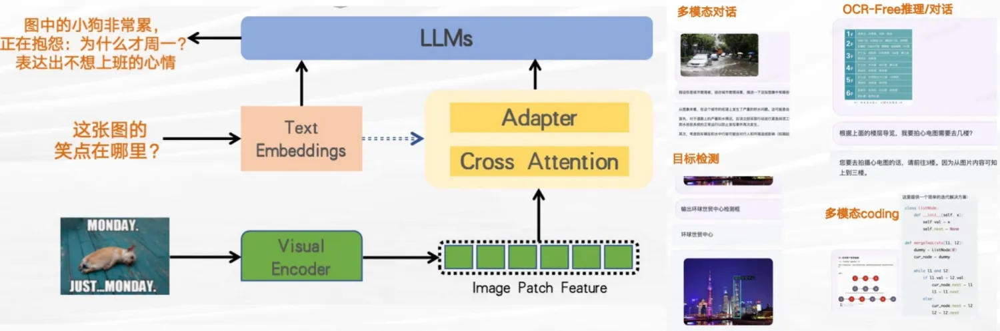

利用文本，图文，视频，音频，或其他辅助特征，提升内容理解的效果。在大模型技术兴起后，目前的主流技术是在输入侧融合多元特征，最后交由大模型输出内容理解文本。请注意区别于“文生图”任务。多模态内容理解任务包括：

- 内容结构化分析 
    - 图文的分类
    - 图文的打标签
    - 内容的主题提取
    - 内容的情感分析等

- 内容质量评价
    - 图文的质量评价，高质量的用于首图展示
    - 内容的审核：色情、赌博、迷信、暴力、低俗
    - 图文一致性理解

- 内容的生成
    - 视频与图像的描述 （Image Caption）
    - 视觉问答（Visual Question Answering，VQA）

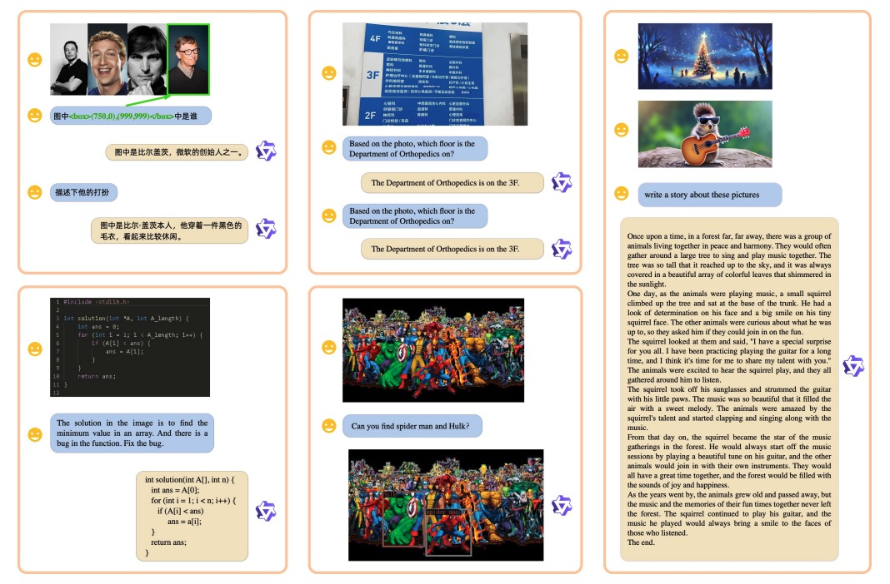

# Qwen系列

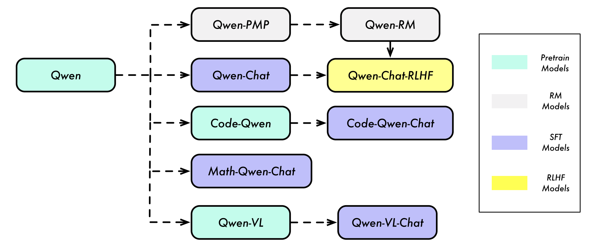

Qwen（通义千问）为大模型家族，其 base model 为 Qwen，目前已经衍生出众多适应下游任务的大模型，我们今天重点讨论其中的多模态版本（VLM）

# Qwen-VL模型详解

论文：[Qwen-VL: A Versatile Vision-Language Model for Understanding, Localization, Text Reading, and Beyond](https://arxiv.org/pdf/2308.12966v2)

## 研究背景

Qwen-VL以Qwen-LM为foundation, 通过：
- (i) visual receptor
- (ii) input-output interface
- (iii) 3-stage training pipeline,
- (iv) multilingual multimodal cleaned corpus 

4种设计赋予模型视觉能力。在多项benchmark上达到最佳性能。
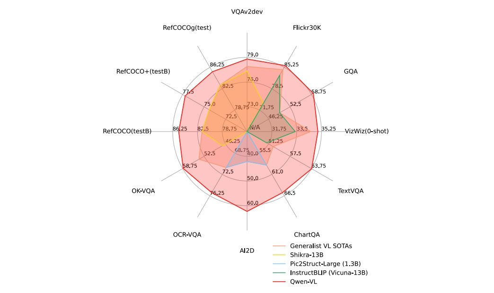

## 架构设计

### 整体结构

模型由以下3个部分组成：
- **Large Language Model**(LLM主干网络): 已预训练的Qwen大语言模型作为foundation进行初始化；
- **Visual Encoder**(视觉编码器)：预训练的Openclip’s ViT-bigG，image以步长14划分patch；以 ViT-L/14为visual encoder，224x224为图像shape，因此vit output的序列长度是 (224/14)*(224/14) = 256。
- **Position-aware Vision-Language Adapter**(位置感知的适配器)：压缩图像特征，单层cross-attention，设置可训练的embedding作为query，image feature作为keys。将feature序列长度固定压缩到256(Stage1预训练阶段本来就是256， stage2预训练阶段 high resolution作为输入
。为什么选择256，通过消融实验得到256个query loss最小，看下图。同时添加2D绝对位置编码，目的在压缩期间缓解位置细节的损失。

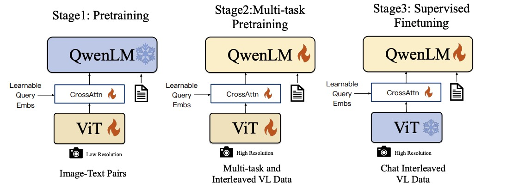

### 输入输出

对于输入LLM前的特征序列，为了区分图片和文本的输入信息，对图片的feature使用了特殊的token包裹:

- **Image input**: 图像经过encoder和adapter变成fixed-length sequence image feature，`` and `</img>`添加在图像特征前后。
- **Bounding BoxInput and Output**: box的位置以字符串格式"(X_topleft, Y_topleft),(X_bottomright, Y_bottomright)" 正常被tokenized为text，不需要额外的位置词汇库，bounding box的前后添加特殊的tokens `<box>` and `</box>`； 关于box内的描述内容使用 `<ref>` and `</ref>`。

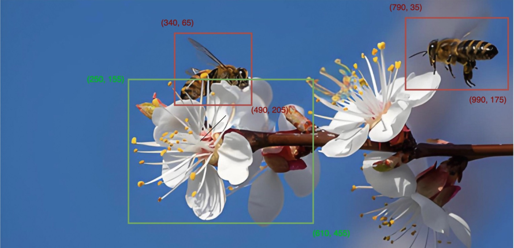

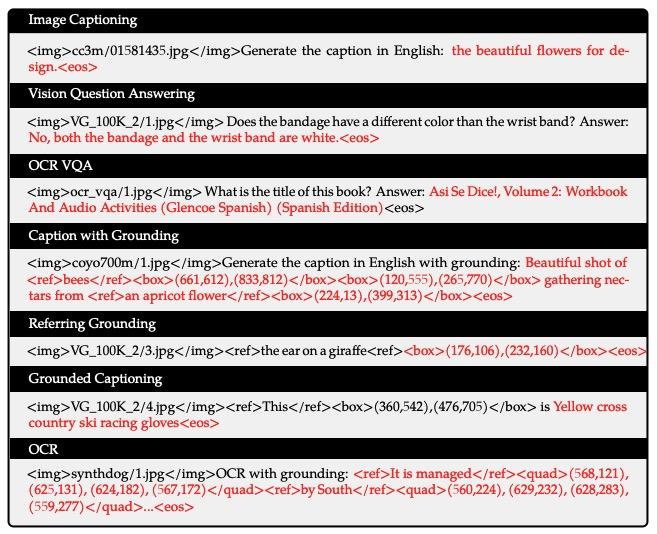

## 训练


Qwen-VL总共包含3个阶段，两个pre-training和1个instruction fine-tunning。Qwen原始的LLM模型如下图所示，Qwen-VL只不过在文本Embedding时，同时也将vision embedding信息也拼接在一起了。

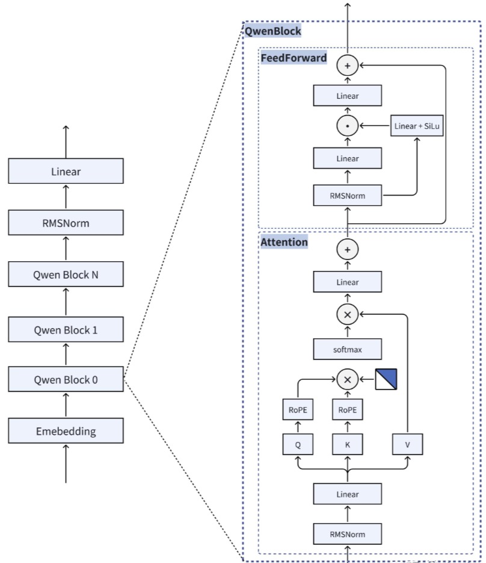

### Stage1 Pre-training
- 数据：large-scale, weakly labeled, web-crawled set of image-text pairs。需要做数据清洗工作，77.3%英文数据和22.7%中文数据。
- 方法：仅优化 vision encoder 和 VL adapter。输入224x224 image，1.5 billion的image-text samples，500 billione tokens。目标：最小化text-token的交叉熵损失。

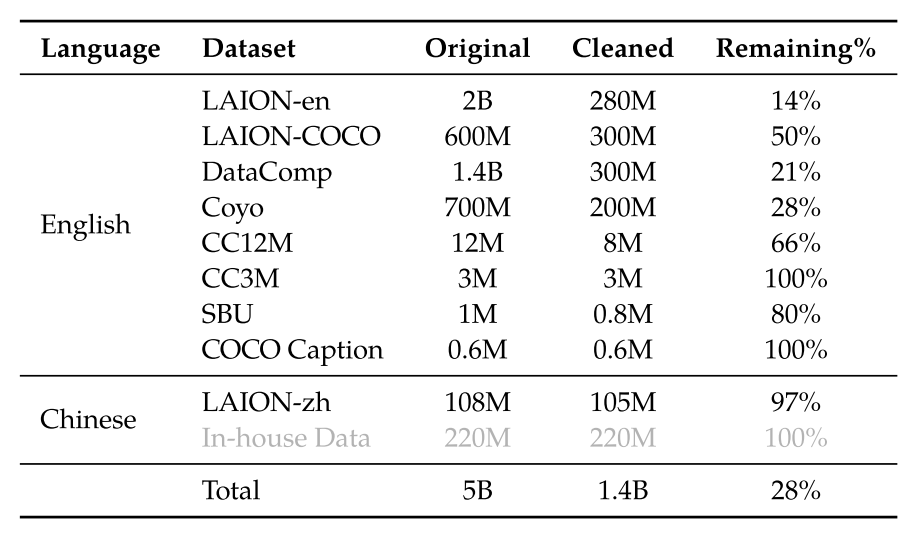

### Stage2 Multi-task Pre-training

- 数据：high-quality and fine-grained VL annotation data。Vision encoder的输入从224x224变为448x448。


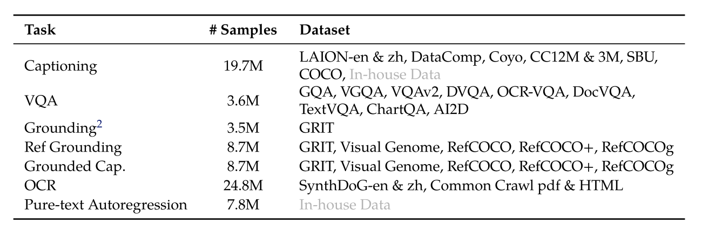

### Stage3 Supervised Fine-tuning

- **目的**：通过指令微调的方式，提升模型对话能力。
多模态指令微调数据来源于caption数据和LLM产生的对话数据。同时将多模态数据和纯文本对话数据进行混合，确保模型有通用对话能力，训练数据350K。模型训练阶段Freeze vision encoder，仅训练语言模型和adapter。
- 数据格式示例：


**为了保证预测和训练数据分布的一致性，模型只监督answer和special tokens（蓝色部分），不监督role name和question**。

```python
# 举例，ChatML数据格式
<|im_start|>user\npng</img>What is the sign in the picture?<im_end>\n<im_start>assistant\nThe sign is a road.<im_end>\n

# 输入的token数据, 下面以文字代称其对应的token特征数据
# \n对应的token是nl_token, 图片对应的tokens是png_tokens(256个tokens), user_msg是user的话, assistant_msg是assistant的话
input_id = [<im_start>, user, nl_token, , png_tokens(256个tokens), </img>, tokenizer(user_msg).input_ids, <im_end>, nl_token, <im_start>, assistant, nl_token, tokenizer(assistant_msg).input_ids, <im_end>,nl_token]
input_id += [pad_token_id] * (max_len - len(input_id))
 
# target数据格式
# IGNORE_TOKEN_ID表示mask
target = [<im_start>, IGNORE_TOKEN_ID * (len(user的信息)-3), <im_end>, nl_token, 
                <im_start>, IGNORE_TOKEN_ID, IGNORE_TOKEN_ID , tokenizer(assistant_msg).input_ids, <im_end>,nl_token]
target += [IGNORE_TOKEN_ID] * (max_len - len(target))
```

蓝色部分字体表示要监督的。训练的时候, 通过shift_logits和shift_labels进行对齐。

```python
if labels is not None:
    # Upcast to float if we need to compute the loss to avoid potential precision issues
    logits = logits.float()
    # Shift so that tokens < n predict n
    shift_logits = logits[..., :-1, :].contiguous()
    shift_labels = labels[..., 1:].contiguous()
    # Flatten the tokens
    loss_fct = CrossEntropyLoss()
    shift_logits = shift_logits.view(-1, self.config.vocab_size)
    shift_labels = shift_labels.view(-1)
    # Enable model parallelism
    shift_labels = shift_labels.to(shift_logits.device)
    loss = loss_fct(shift_logits, shift_labels)
```


# Qwen2-VL模型详解

Qwen2-VL 是对 Qwen-VL 的改进版本。具体来说，当前的 LVLM 仍然存在一些问题：

1. 输入受限于必须固定图片的大小 —— Naive Dynamic Resolution 机制
2. 大多数 vision-encoder 仍然依赖于固定的 CLIP-style 的结构，或 fine-tuning 的 ViT —— ViT 中加入 2D Rotary Position Embedding (RoPE)
3. 真实世界是三维的，一维的 embedding 很难有效捕捉特征 —— Multimodal Rotary Position Embedding (M-RoPE) 来分别表示时间、空间信息

## Qwen2-VL模型的组成部分

官方Repo：https://github.com/QwenLM/Qwen2-VL

Qwen2-VL模型主要包含以下几个部分，结合官方infer代码的流程可以对应:

```
1. chat_template: 用于将输入转化为模型所需要的标准格式，如ChatML格式；
2. processor: 
    image_process:对图像进行预处理，将图像转化为模型所需要的格式，如切分patch操作；
    tokenizer: 文本prompt处理和tokens预定义；
    数据整合
3. prepare_inputs: 准备model_inputs,用于输入到model中
4. model:
    vision model: vision提取特征信息；
    Embedding: prompt Embedding;
    Scatter: 将visiion embedding tokens嵌入到prompt tokens中
    LLM: Qwen大语言模型
```

沿着上面组成部分顺序我们对Qwen2-VL的架构进行拆解：

## chat_template处理

Qwen2-VL采用ChatML格式template。首先加载好MODEL_PATH, 执行processor.chat_template即可查看Qwen2-VL的模版形式。本文通过下面举一个例子进行:
```python
# 加载模型
processor = AutoProcessor.from_pretrained(MODEL_PATH, min_pixels=min_pixels, max_pixels=max_pixels)
print(processor.chat_template)
# 设置conversation
prompt = "请描述这两张图片"
conversation = [
        {
            "role": "user",
            "content": [
                {"type": "image", "image": "./0001.png"},
                {"type": "image", "image": "./0002.png"},
                {"type": "text", "text": prompt},
            ],
        }
    ]
# 假设我们设置上面的conversation, 转化为template形式如下, 注意换行符也是一个token
print(processor.apply_chat_template(conversation))
'''<|im_start|>system\n
You are a helpful assistant.<|im_end|>\n
<|im_start|>user\n
<|vision_start|><|image_pad|><|vision_end|><|vision_start|><|image_pad|><|vision_end|>请描述这两张图片<|im_end|>\n
'''
print(processor.apply_chat_template(conversation, add_generation_prompt=True)) # 添加推理token
'''<|im_start|>system\n
You are a helpful assistant.<|im_end|>\n
<|im_start|>user\n
<|vision_start|><|image_pad|><|vision_end|><|vision_start|><|image_pad|><|vision_end|>请描述这两张图片<|im_end|>\n
<|im_start|>assistant\n
'''
```
可以看到Qwen2-VL将图片编码为<|vision_start|><|image_pad|><|vision_end|>形式。

## process 处理

process包含image_processor图像处理和tokens的预定义处理

### image_processor

image_process位于`image_processing_qwen2_vl.py`中`Qwen2VLImageProcessor`类。以1080*1920图为例，处理流程：

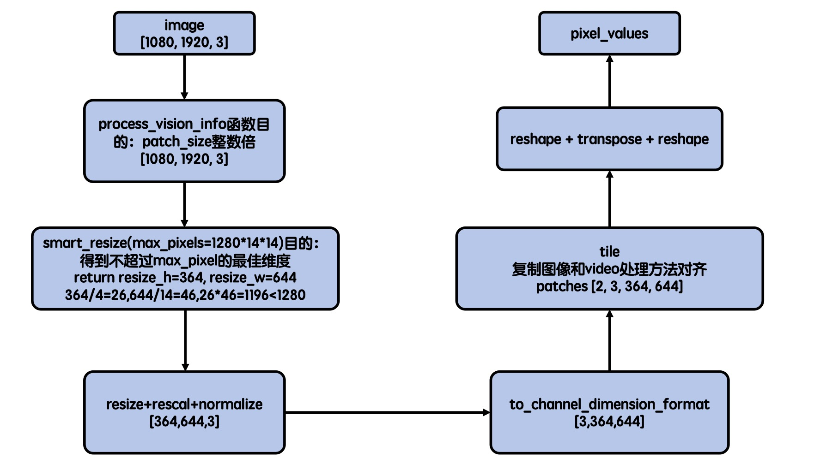

Qwen2-VL在图像预处理主要两部分：
```
1. smart_resize：
   将图像的宽高reszie到patch_size的整数倍，比如(1080, 1920)的图像变为(1092, 1932);
   目的：patch_size的整数倍，patch数量不要超过ViT的上限。
2. 图片flatten到(patch_num_h * patch_num_w) 个 patch  (patch_size * patch_size)
```

#### smart_resize

**第一个细节点：为什么要设置factor=14*2里面包含2，不直接等于28, max_pixels=14*14*4*1280包含4，不直接设置14*14*5120?**

smart_resize函数可以看到factor=14*2, max_pixels=14*14*4*1280,这个和论文Naive Dynamic Resolution方法(先按patch_size=14切分，然后在通过MLP对相邻的2x2的tokens进行特征合并，得到最终的vision token)对齐，如果factor设置为14有可能横纵可能是奇数的patch数量，max_pixels里面的"4"和相邻2x2tokens进行MLP对齐。

```python
# 生成patch_size正式倍的宽高，且位于min_pixels和max_pixels之间
resized_height, resized_width = smart_resize(
                    height, #原始图像宽高
                    width,
                    factor=self.patch_size * self.merge_size, # 14 * 2
                    min_pixels=self.min_pixels,
                    max_pixels=self.max_pixels,
                )
image = resize(
                    image, size=(resized_height, resized_width), resample=resample, input_data_format=input_data_format
                )

def smart_resize(
    height: int, width: int, factor: int = 28, min_pixels: int = 56 * 56, max_pixels: int = 14 * 14 * 4 * 1280
):
    h_bar = round(height / factor) * factor
    w_bar = round(width / factor) * factor
    if h_bar * w_bar > max_pixels:
        beta = math.sqrt((height * width) / max_pixels)
        h_bar = math.floor(height / beta / factor) * factor
        w_bar = math.floor(width / beta / factor) * factor
    elif h_bar * w_bar < min_pixels:
        beta = math.sqrt(min_pixels / (height * width))
        h_bar = math.ceil(height * beta / factor) * factor
        w_bar = math.ceil(width * beta / factor) * factor
    return h_bar, w_bar
```

#### patch切分细节

**第2个细节点： patch切分和reshape。为什么reshape成这个那么长串的维度，再transpose再reshape呢？为何不直接reshape成(1196, 1176)？**

是为了后面MLP(2x2相邻token进行准备), 不让相邻的2x2patches分开, 如果直接reshape(grid_t * grid_h * grid_w, ...) 那么是按行进行切分，相邻的2x2的patch flatten后就不相连了；这样的切分方式可以保证2x2patch flatten后是相连的, 方便后面MLP的时候切分。

```python
# self.temporal_patch_size = 2
# self.merge_size = 2
# patches.shape = (2, 3, H, W), 以h=364, w=644为例
grid_t = patches.shape[0] // self.temporal_patch_size # 1
# 宽高按patch_size进行切分数量, grid_h=26, grid_w=46
grid_h, grid_w = resized_height // self.patch_size, resized_width // self.patch_size 
# patch shape: [1,2,3,13,2,23,2,14]
patches = patches.reshape(
    grid_t,
    self.temporal_patch_size,
    channel,
    grid_h // self.merge_size, # 注意：为什么再除self.merge_size，为了后面MLP(2x2相邻tokens)
    self.merge_size,
    self.patch_size,
    grid_w // self.merge_size,
    self.merge_size,
    self.patch_size,
    ) 
# 维度变换(1, 13, 23, 2, 2, 3, 2, 14, 14)
patches = patches.transpose(0, 3, 6, 4, 7, 2, 1, 5, 8)
# flatten_patches.shape = (1196, 1176)
flatten_patches = patches.reshape(
    grid_t * grid_h * grid_w, channel * self.temporal_patch_size * self.patch_size * self.patch_size
)
```

图像image_processor最终返回image_inputs：

```python
# pixel_values.shape = (2392, 1176) 传了两幅图像
# vision_grid_thws = array([[ 1, 26, 46], [ 1, 26, 46]])
image_inputs = {"pixel_values": pixel_values, "image_grid_thw": vision_grid_thws}
```

### tokens 预定义

通过计算横纵patch的数量，将text中的`<image_pad>`替换为`image_grid_thw[index].prod() // merge_length`个`<|placeholder|>`,为什么需要除merge_length? 就是和MLP(2x2相邻patch)变成一个vision token有关。
然后再将所有的`<|placeholder|>`变成`<image_pad>`

```python
# merge_length = 4
merge_length = self.image_processor.merge_size**2
index = 0
for i in range(len(text)):
    while self.image_token in text[i]:
        text[i] = text[i].replace(
            self.image_token, "<|placeholder|>" * (image_grid_thw[index].prod() // merge_length), 1
        )
        index += 1
    '''
    text = <|im_start|>system\n
            You are a helpful assistant.<|im_end|>\n
            <|im_start|>user\n
            <|vision_start|><|placeholder|> * 26*46/4 <|vision_end|><|vision_start|><|placeholder|> * 26*46/4<|vision_end|>请描述这两张图片<|im_end|>\n
            <|im_start|>assistant\n
    '''
    text[i] = text[i].replace("<|placeholder|>", self.image_token)
    '''
    text = <|im_start|>system\n
            You are a helpful assistant.<|im_end|>\n
            <|im_start|>user\n
            <|vision_start|><image_pad> * 26*46/4 <|vision_end|><|vision_start|><image_pad> * 26*46/4<|vision_end|>请描述这两张图片<|im_end|>\n
            <|im_start|>assistant\n
    '''
# 将text的文本tokenizer编码为id的形式
# text_inputs.kyes = (['input_ids', 'input_ids'])
# input_ids=[[151664,...,198], attention_mask=[[1,..,1]]
text_inputs = self.tokenizer(text, **output_kwargs["text_kwargs"])
```

### processor

经过前面image_processor得到image_inputs, text_prompt tokenizer得到text_inputs。最后processor将这两部分的信息合并起来得到inputs。

```python 
image_inputs = {"pixel_values": pixel_values, "image_grid_thw": vision_grid_thws}
text_inputs = {"input_ids": input_ids, "attention_mask": attention_mask}
inputs = {"input_ids": input_ids, "attention_mask": attention_mask, "pixel_values": pixel_values, "image_grid_thw": vision_grid_thws}
```

## model input数据准备

### model_inputs变量

model_inputs：Qwen2VL模型的输入。

数据准备位于Qwen2VLForConditionalGeneration.prepare_inputs_for_generation()，得到model_inputs。

```python
model_inputs=
    {   "input_ids": input_ids, # token的index
        "position_ids": position_ids, # 3D RoPE的位置编码index
        "past_key_values": past_key_values, # DynamicCache()用于储存KVCache的信息
        "use_cache": use_cache, # 是否采用cache
        "attention_mask": attention_mask, # 推理的attention mask
        "pixel_values": pixel_values, # images的patch 原始像素信息
        "pixel_values_videos": pixel_values_videos, #video的patch 原始像素信息
        "image_grid_thw": image_grid_thw, # images的patch数量信息
        "video_grid_thw": video_grid_thw, # video的patch数量信息
        "rope_deltas": rope_deltas, # rope的惩罚系数
    }
```

### position_ids变量生成

**作用**：3D RoPE位置编码index，包含tempraol,height和width。
图像包含3个维度的index是不同的,而文本3个维度的index是一样的。如下图所示:

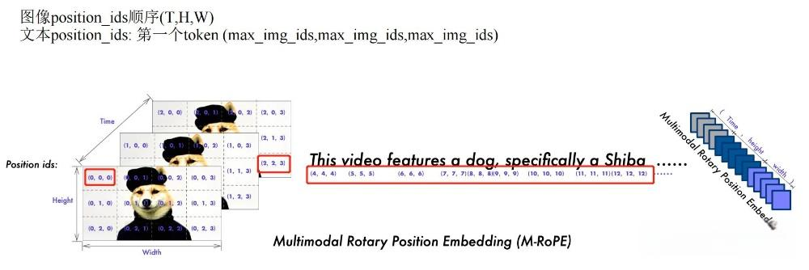

```python
# 代码位于：Qwen2VLForConditionalGeneration.get_rope_index()
# 假设input_ids:[V V V V V V V V V V V V T T T T T], V表示vision的token <image_pad>, T表示text的token
# 计算图像和文本的 temproal, height和width的位置编码index
vision temporal position_ids: [0, 0, 0, 0, 1, 1, 1, 1, 2, 2, 2, 2]
vision height position_ids: [0, 0, 1, 1, 0, 0, 1, 1, 0, 0, 1, 1]
vision width position_ids: [0, 1, 0, 1, 0, 1, 0, 1, 0, 1, 0, 1]
text temporal position_ids: [3, 4, 5, 6, 7]
text height position_ids: [3, 4, 5, 6, 7]
text width position_ids: [3, 4, 5, 6, 7]
# 文本开始的position_idx是vision position_idx的最大值+1
# 最后将不同维度的图和文本的position_ids进行拼接，输出最终的position_ids，shape:[3, 1, num_tokens]
```

## model推理过程

### Qwen2-VL主干

Qwen2-VL模型推理位于`modeling_qwen2_vl.py`中`Qwen2VLForConditionalGeneration`类。通过将上述的`processorj`将`model_inputs`输入到`Qwen2VLForConditionalGeneration.forward`中进行推理。

整体架构图如下：

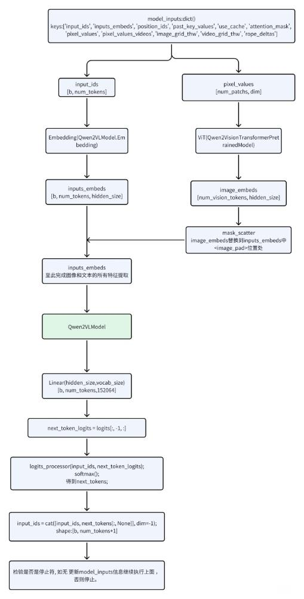

### ViT(Qwen2VisionTransformerPretrainedModel)

ViT是对image和video进行特征提取，其中包含2D旋转位置编码生成、PatchEmbed(时序Conv3D, 特征提取)、Qwen2VLVisionBlock(ViT tokens特征提取)、PatchMerger(降低vision token数量)。

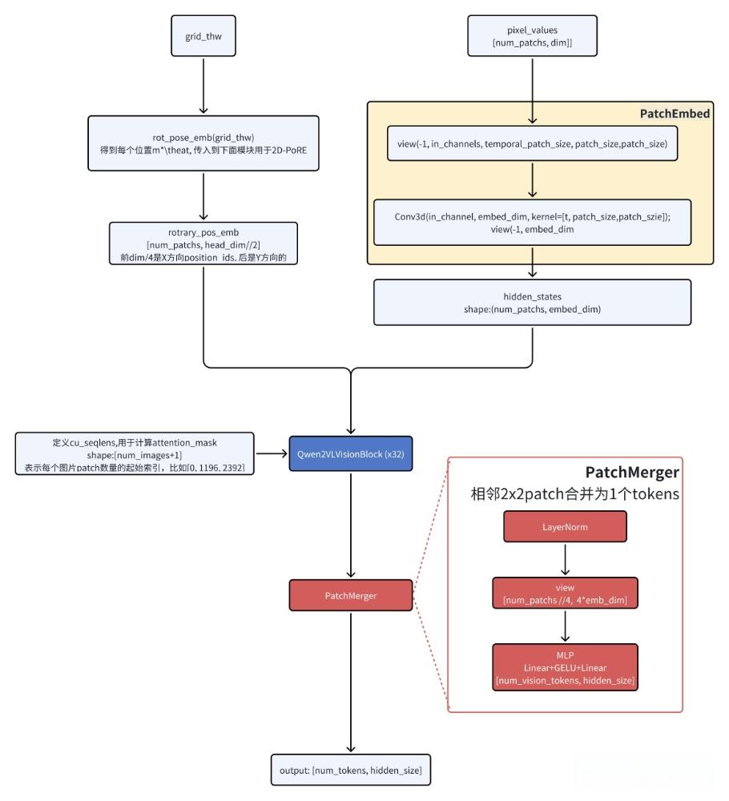

#### Qwen2VLVisionBlock

ViT中的Qwen2VLVisionBlock主要是VisionSdpaAttention构成，其中涉及2D-RoPE。

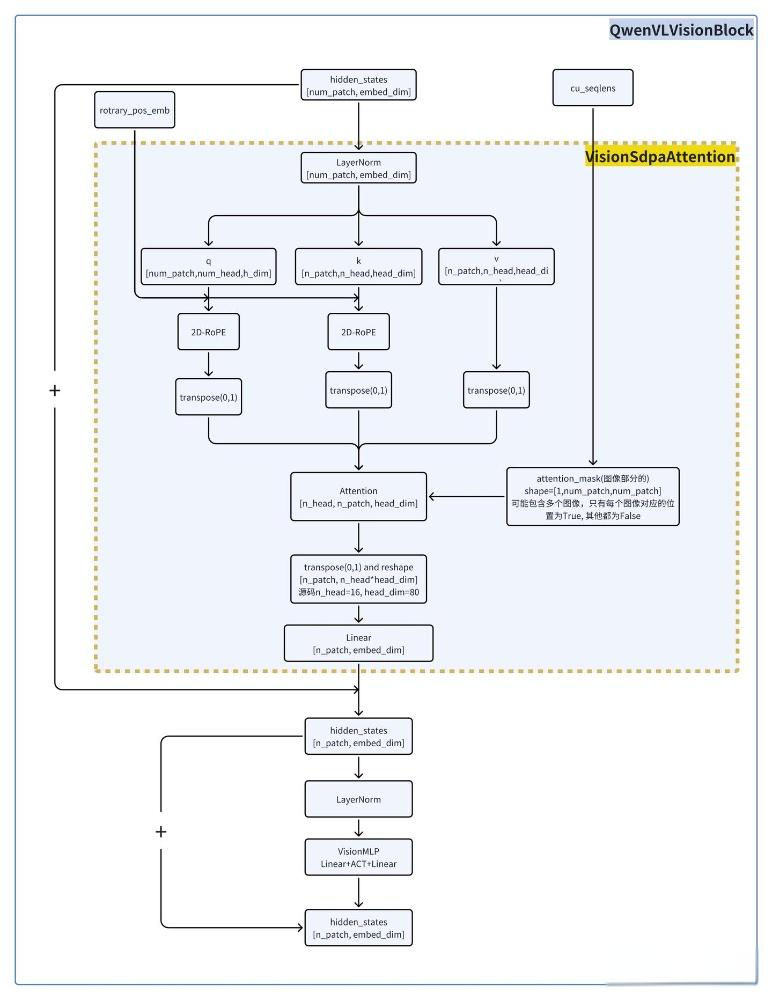

### Qwen2VLModel

Qwen2VLModel生成模块的主干结构，主要包含3D位置编码的生成、DecoderLayer。结构和变量维度如下所示：

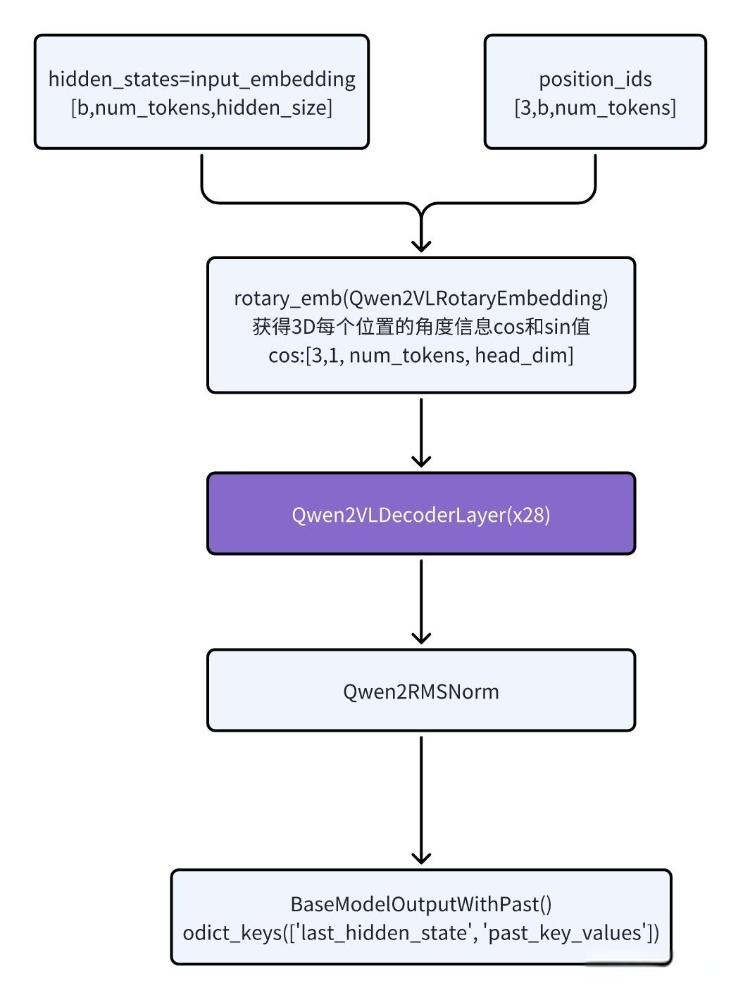

#### Qwen2VLDecoderLayer

Qwen2VDecoderLayer主要包含Qwen2VLSdpaAttention和KV Cache等模块。

```python
# 输入数据:shape
hidden_states:[b,num_tokens,hidden_size]
attention_mask:[b, num_tokens]
position_ids:[3,b,num_tokens]
past_key_value:DynamicCache()
output_attentions:False
use_cache:True
cache_position:[num_tokens]
position_embeddings:(cos:[3,1,num_tokens, head_dim], sin:[3,1,num_tokens, head_dim])
```

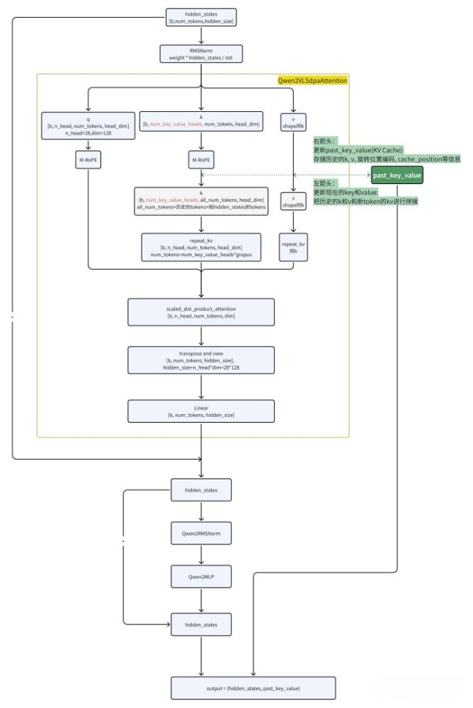

#### Qwen2VLSdpaAttention

在Qwen2VLSdapaAttention中添加了KV Cache。其中生成query和key、value的Linear的维度是不同的, 然后将每一层的key和value等信息更新到past_key_value用于KVCache，例如decoder循环28次，则len(past_key_values.key_cache)=28，past_key_values.key_cache[0].shape=[b, num_key_value_heads, num_tokens, head_dim]。

Qwen2VLSdapaAttention输出attention后特征hidden_states和present_key_value(更新后的past_key_value)。

```python
# [b, num_head, num_tokens, head_dim]
query_states = query_states.view(bsz, q_len, self.num_heads, self.head_dim).transpose(1, 2)
# [b, num_key_value_heads, num_tokens, head_dim]
key_states = key_states.view(bsz, q_len, self.num_key_value_heads, self.head_dim).transpose(1, 2)
value_states = value_states.view(bsz, q_len, self.num_key_value_heads, self.head_dim).transpose(1, 2)

# 将key_states和value_states更新到past_key_value中, 旋转位置编码和cache_position
cache_kwargs = {"sin": sin, "cos": cos, "cache_position": cache_position}  # Specific to RoPE models
key_states, value_states = past_key_value.update(key_states, value_states, self.layer_idx, cache_kwargs)
            
# 通过repeat_kv将key_states和value_states扩大self.num_key_value_groups倍，与query_state维度对齐
key_states = repeat_kv(key_states, self.num_key_value_groups)
value_states = repeat_kv(value_states, self.num_key_value_groups)
```

#### KV Cache的作用

past_key_value用于储存KV Cache所需要的信息。可以发现在数据准备的时候，需要提前把这些信息准备好。在预测第一个token时，input_ids是[1, num_tokens]，而在进行预测第二个甚至更往后的时候使用KV Cache，model_inputs数据如下所示

```python
# 当使用KV Cache时, 预测T+1后更新model_inputs；
model_inputs=
    {   "input_ids": input_ids, # T+1的token的index, shape=[1,1]，T表示原始输入的num_tokens
        "inputs_embeds":inputs_embeds, #None
        "position_ids": position_ids, # 3D RoPE的位置编码index, shape:[3, 1, 1]
        "past_key_values": past_key_values, # DynamicCache()用于储存KVCache的信息
        "use_cache": use_cache, # 是否采用cache
        "attention_mask": attention_mask, # 推理的attention mask
        "pixel_values": pixel_values, # None
        "pixel_values_videos": pixel_values_videos, # None
        "image_grid_thw": image_grid_thw, # images的patch数量信息
        "video_grid_thw": video_grid_thw, # video的patch数量信息
        "rope_deltas": rope_deltas, # 输入的最后一个token的position_ids与num_tokens的差值，用于计算新生产的token的position_ids
    }
```

此时pixel_values和pixel_values_videos都是None。图像特征就不需要经过ViT，只对新的token进行embedding，此时进行Qwen2VLSdapaAttention进行attention时，num_tokens=1。因此在输入到Qwen2VL前发生了一点点变化。

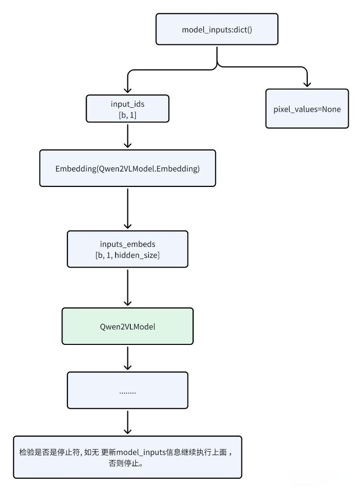

### ViT-2D多维RoPE

1D-RoPE的实现方法：

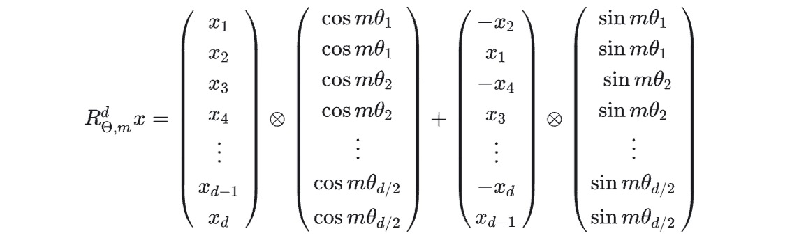

2D-RoPE的实现方法，可以对比发现，序列编码最大到d/4，两个特征为X方向的编码ids进行旋转，然后再两个特征为Y方向的编码ids进行旋转，依次类推。

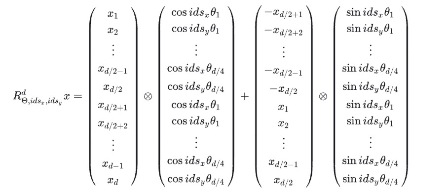

代码实现如下：

1. 计算2D旋转位置编码的角度信息 rotary_pos_emb
```python 
def rot_pos_emb(self, grid_thw):
    '''
    得到每个patch位置的2D-位置编码的正余弦()内的角度信息, 然后再对xy方向进行flatten
    '''
    pos_ids = []
    for t, h, w in grid_thw:
        # [h, w]
        hpos_ids = torch.arange(h).unsqueeze(1).expand(-1, w) 
        # [h//spatial_merge_size, spatial_merge_size, w//spatial_merge_size, spatial_merge_size], spatial_merge_size=2
        hpos_ids = hpos_ids.reshape(
            h // self.spatial_merge_size,
            self.spatial_merge_size,
            w // self.spatial_merge_size,
            self.spatial_merge_size,
        ) 
        # [h//spatial_merge_size,  w//spatial_merge_size, spatial_merge_size, spatial_merge_size]
        hpos_ids = hpos_ids.permute(0, 2, 1, 3) 
        # [h*w]
        hpos_ids = hpos_ids.flatten() 

        wpos_ids = torch.arange(w).unsqueeze(0).expand(h, -1)
        wpos_ids = wpos_ids.reshape(
            h // self.spatial_merge_size,
            self.spatial_merge_size,
            w // self.spatial_merge_size,
            self.spatial_merge_size,
        )
        wpos_ids = wpos_ids.permute(0, 2, 1, 3)
        wpos_ids = wpos_ids.flatten()
        pos_ids.append(torch.stack([hpos_ids, wpos_ids], dim=-1).repeat(t, 1)) # [t, h*w, 2]
    # [n*h*w, 2], 每个patch的(x,y)位置，比如这个例子就是[2392,2]
    pos_ids = torch.cat(pos_ids, dim=0) 
    max_grid_size = grid_thw[:, 1:].max()
    # [max_grid_size, head_dim//4], x和y每个方向最大的就是\theta_{d//4}
    rotary_pos_emb_full = self.rotary_pos_emb(max_grid_size)
    # 提取每个patch的x,y的embedding角度信息m*\theta_{i}, [nhw, 2, head_dim//4] -> [nhw, head_dim//2]
    rotary_pos_emb = rotary_pos_emb_full[pos_ids].flatten(1)
    return rotary_pos_emb
  # 其中rotary_pos_emb定义如下：
  class VisionRotaryEmbedding(nn.Module):
    def __init__(self, dim: int, theta: float = 10000.0) -> None:
        super().__init__()
        # 就是 1 / (10000^{2i/d})
        inv_freq = 1.0 / (theta ** (torch.arange(0, dim, 2, dtype=torch.float) / dim))
        self.register_buffer("inv_freq", inv_freq, persistent=False)

    def forward(self, seqlen: int) -> torch.Tensor:
        # [seqlen]
        seq = torch.arange(seqlen, device=self.inv_freq.device, dtype=self.inv_freq.dtype) 
        # [seqlen, dim//2], 对应每m个对应的位置编码正余弦里面的数 m/(10000^{2i/dim})
        freqs = torch.outer(seq, self.inv_freq) # 外积
        return freqs
```

通过上面我们得到每个patch对应的2D旋转位置编码的角度信息，然后看看怎么将这个运用高效计算添加到Q和K中：

```python
def apply_rotary_pos_emb_vision(tensor: torch.Tensor, freqs: torch.Tensor) -> torch.Tensor:
    # tensor:query或者key, freqs：2D旋转位置编码的角度信息
    orig_dtype = tensor.dtype
    tensor = tensor.float() # [b, seq_len, num_head, dim]
    cos = freqs.cos() # [seq_len, dim//2]
    sin = freqs.sin() # [seq_len, dim//2]
    # repeat(1,1,2)中的2 就是 公式中的两个相同的 m\theta_i
    cos = cos.unsqueeze(1).repeat(1, 1, 2).unsqueeze(0).float() # 维度对齐 [b, seq_len, num_head, dim]
    sin = sin.unsqueeze(1).repeat(1, 1, 2).unsqueeze(0).float()
    output = (tensor * cos) + (rotate_half(tensor) * sin) # rope 2D高效计算 [b, seq_len, num_head, dim]
    output = output.to(orig_dtype)
    return output
 
 # 其中rotate_half是将[x1,..,x_{d/2},x_{d/2+1},..,x_d]变为[-x_{d/2+1},..,-x_d,x1,..,x_{d/2}]
 def rotate_half(x):
    """Rotates half the hidden dims of the input."""
    x1 = x[..., : x.shape[-1] // 2]
    x2 = x[..., x.shape[-1] // 2 :]
    return torch.cat((-x2, x1), dim=-1)
```

### Modal-RoPE

上面是2D-RoPE直接将每个patch的xy的角度信息embed_dim拼接为2*embed_dim，然后再repeat，也就是dim中一半用x_id的位置编码，一半用y_id的位置编码。

而Modal-RoPE是dim中不同区域取不同信息(temporal, height and width)的位置编码。

疑问：这种dim中不同区域取不一致的，能满足RoPE原理中的相对位置关系证明吗？
首先先看一下rotary_embed如何实现M-RoPE。首先计算head_dim//2个 theta角度信息, 然后与position_id进行相乘得到freqs，最后两个相同的freqs进行拼接得到emb

```python
class Qwen2VLRotaryEmbedding(nn.Module):
 def forward(self, x, position_ids):
        if "dynamic" in self.rope_type:
            self._dynamic_frequency_update(position_ids, device=x.device)

        # Core RoPE block. In contrast to other models, Qwen2_VL has different position ids for thw grids
        # So we expand the inv_freq to shape (3, ...)
        # 首先计算head_dim//2个$$\theta_i$$角度信息，并expand到[3, 1, 64, 1]，其中head_dim=128
        inv_freq_expanded = self.inv_freq[None, None, :, None].float().expand(3, position_ids.shape[1], -1, 1) # [3, 1, 64, 1]
        position_ids_expanded = position_ids[:, :, None, :].float()  # shape (3, bs, 1, positions)
        # Force float32 (see https://github.com/huggingface/transformers/pull/29285)
        device_type = x.device.type
        device_type = device_type if isinstance(device_type, str) and device_type != "mps" else "cpu"
        with torch.autocast(device_type=device_type, enabled=False):
            # $$\theta_i$$与position_ids进行相乘，得到ids * $$\theta_i$$
            freqs = (inv_freq_expanded.float() @ position_ids_expanded.float()).transpose(2, 3) # [3, bs, positions, 64]
            # 相同的freqs进行拼接
            emb = torch.cat((freqs, freqs), dim=-1) # [3, bs, positions, 128]
            cos = emb.cos()
            sin = emb.sin()

        # Advanced RoPE types (e.g. yarn) apply a post-processing scaling factor, equivalent to scaling attention
        cos = cos * self.attention_scaling
        sin = sin * self.attention_scaling

        return cos.to(dtype=x.dtype), sin.to(dtype=x.dtype)
```

上面通过freqs得到每个维度的cos和sin信息。那么在多维怎么做RoPE呢？是每个维度切取一部分的位置编码，然后进行拼接得到最终的旋转位置编码，这样就包含了不同维度的位置信息。以head_dim=128举例，公式和code实现如下, 例如$x_1$和$x_{65}$特征值进行了旋转。

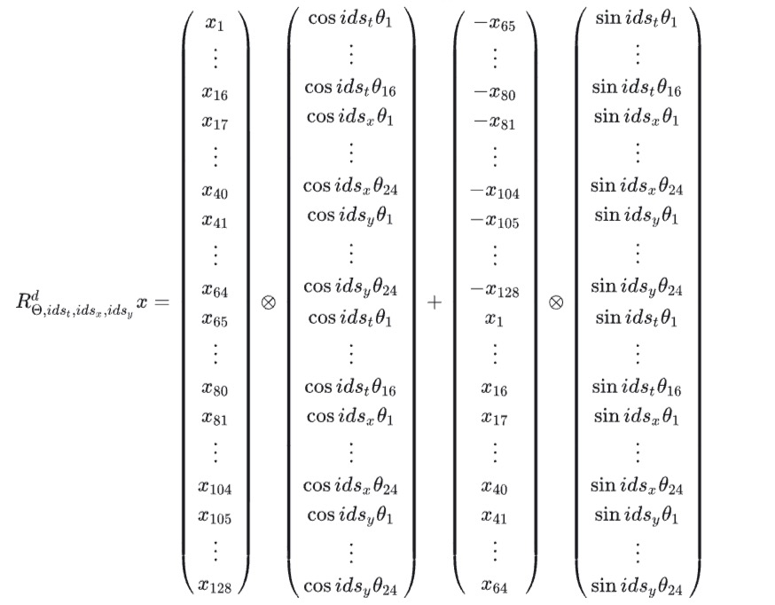

```python
# position_ids是一个[3, b, num_tokens], 每个token有3个方向temporal, height and width的位置编码id
# cos.shape = [3,b,num_tokens, 128]
# sin.shape = [3,b,num_tokens, 128]
# q,k.shape = [b,n_head,num_tokens,dim] dim=128
def apply_multimodal_rotary_pos_emb(q, k, cos, sin, mrope_section, unsqueeze_dim=1):
    # mrope_section = [16, 24, 24, 16, 24, 24]
    mrope_section = mrope_section * 2 
    # 先将cos对dim维度划分为6组数据，[3, 1, num_tokens, 16], [3, 1, num_tokens, 24], ...
    # (1) 第1组数据slice[0,...]即(temporal)出来[1,num_tokens,16]。
    # (2) 第2组数据slice[1,...]即(height)出来[1,num_tokens,24]
    # (3) 第3组数据slice[2,...]即(width)出来[1,num_tokens,24]
    # (4) 第4组数据slice[0,...]即(temporal)出来[1,num_tokens,16]，由于freqs(128)前一半(64)和后一半(64)相同, 这一块的freqs则与(1)中的freqs是相同的
    # (5) 第5组数据slice[1,...]即(height)出来[1,num_tokens,24]
    # (6) 第6组数据slice[2,...]即(width)出来[1,num_tokens,24]
    # cat拼接为[1,1,num_tokens,128]
    cos = torch.cat([m[i % 3] for i, m in enumerate(cos.split(mrope_section, dim=-1))], dim=-1).unsqueeze(
        unsqueeze_dim
    )
    # sin处理和cos一样的
    sin = torch.cat([m[i % 3] for i, m in enumerate(sin.split(mrope_section, dim=-1))], dim=-1).unsqueeze(
        unsqueeze_dim
    )
    # 希望0-15特征元素使用temporal类型的位置编码, 16-39使用height类型的位置编码, ...
    q_embed = (q * cos) + (rotate_half(q) * sin)
    k_embed = (k * cos) + (rotate_half(k) * sin)
    return q_embed, k_embed
```

# Qwen3-VL模型详解

- Blog：https://qwen.ai/blog?id=99f0335c4ad9ff6153e517418d48535ab6d8afef
- 代码：https://github.com/QwenLM/Qwen3-VL

## 核心亮点

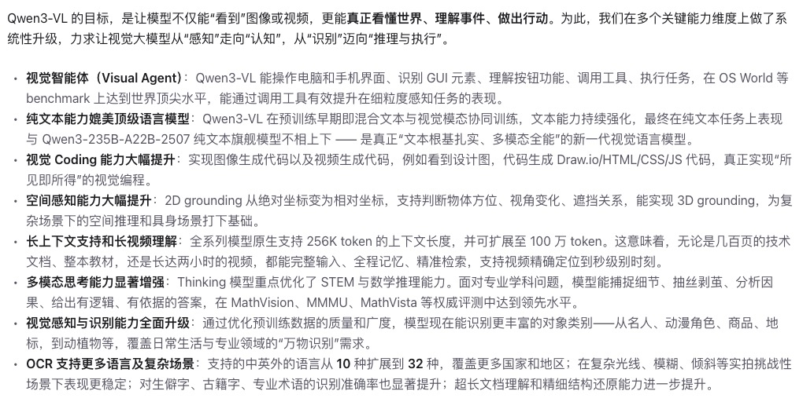

## 架构

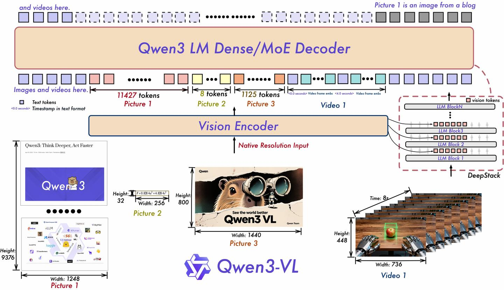

Qwen3-VL 的架构乍一看还是经典的结构：Vision Encoder + Adapter + LLM。但实际上主要有三大架构升级。

- `DeepStack` : 融合 ViT 多层次特征，将视觉特征注入 LLM 的多层中，实现更精细化的视觉理解和图文对齐精度。
- `MRoPE-Interleave`: 改进位置编码，采用时间(t)、高度(h)、宽度(w)交错分布形式，提升对长视频的理解能力。
- `文本时间戳对齐机制 (T-RoPE 升级)`: 采用“时间戳-视频帧”交错输入形式，实现帧级别时间信息与视觉内容的细粒度对齐，提升视频事件定位精度。

### DeepStack

以前的多模态模型（包括 Qwen2-VL），通常只把Vision Encoder最后一层的输出喂给 LLM。这就像是你去旅游，只给朋友看最后修好的精修图，朋友虽然知道你去过海边，但照片里路边的野花、墙边的砖块这些的细节全丢了。

DeepStack 机制做了一个操作：`它不再只走正路线，而是开了三个支线搞辅助连接`。而且我发现，Qwen3-VL 在这里非常壕，它没有为了省参数去复用 MLP Merger 模块，而是一共部署了 4 个 MLP Merger（1 个主路 + 3 个支线）。

> TIP：各种论文里面的 MLP，Adapter, Merger 其实就是指的是 MLP，也就是一个“四倍上投影Linear + 激活函数 + 四倍下投影Linear”。

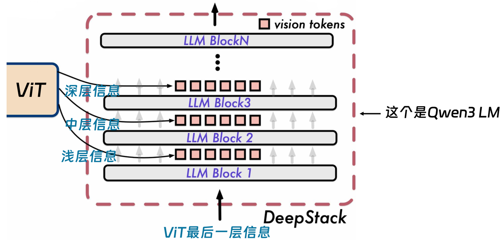

**怎么连？**

- 主路：ViT 最后一层 -> 主 MLP Merger -> 变成 Input Embeddings（告诉 LLM 整体是啥）。
- 支线：它从 ViT 的 浅层、中层、深层 分别提取特征。注意，每一层特征都有一个独立专用的 Merger 进行投影，然后依次残差连接到 LLM 的第 1、2、3 层。
    - ViT 浅层（看纹理、边缘） -> 专用 Merger A -> 注入 LLM 第 1 层
    - ViT 中层（看形状、结构） -> 专用 Merger B -> 注入 LLM 第 2 层
    - ViT 深层（看语义、类别） -> 专用 Merger C -> 注入 LLM 第 3 层

这种多轨制设计，让 LLM 既能通过主路看懂大意，又能通过辅路看清细节。这就是为什么 Qwen3-VL 做 OCR 和文档分析那么强的原因。

### MRoPE-Interleave

之前的 Qwen2-VL 用了一种叫 MRoPE 的位置编码，把时间(t)、水平(h)、垂直(w)分开编码。但qwen团队发现，这样做会导致频率谱不平衡，简单说就是模型在处理长视频时，对时间的感觉会变差。

Qwen3-VL 改用了 Interleaved MRoPE。和名字一样，就是：它把 t, h, w 的编码像洗牌一样均匀地插在了一起。这让模型在长达 256K 的上下文里，依然能精准地定位到“视频第 58 分钟左上角的那只猫”。

### 文本时间戳对齐机制 

Qwen2.5-VL 用绝对时间位置编码来告诉模型“这是第几秒”。结果发现，视频太长的时候，这个数字变得巨大且稀疏，模型学懵了。Qwen3-VL 改成直接用纯文本来打标签，如：<4.0 seconds>。

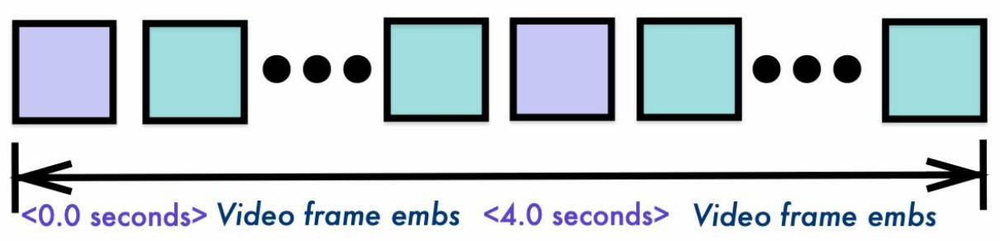

这就好比，与其给模型一个复杂的数学坐标，不如直接在画面上贴个便利贴写着“这是第 4 秒”。

## 无比细致的数据工程

很多同学以前对多模态数据的理解可能比较糙，觉得不就是“图+文字”吗？但 Qwen3-VL 这次把数据做得非常细。有兴趣的话可以详细了解下论文的`Section 3.2`，通过应用场景将训练数据进行了介绍。这里我们介绍几个典型Case

### 穿插文图：像读绘本一样看故事

以前了解的数据很多是一张图配一句描述。但 Qwen3-VL 用了大量的交错数据。

比如当前数据是一本《大灰狼》童话书：

- 数据格式：“大灰狼住在大尾巴山...”，中间突然插一个 <image> 之类的占位符（放狼的照片），然后继续讲“它有一身灰毛...”。
- 训练原理：模型读到占位符时，视觉编码器启动，把图片变成向量塞进去。这样模型就学会了在长篇大论中，顺便看一眼图，保持上下文的连贯。
- 自动化流水线：这是个亮点。为了处理海量的 PDF 和书籍，团队没有用传统的脚本硬切，而是微调了一个上一代的 Qwen2.5-VL-7B 模型专门做多模态解析。

```
从前，小红帽提着篮子走进森林去看望生病的外婆。森林里静悄悄的，阳光透过树叶洒下来。突然，前方的草丛里传来了沙沙声，一只巨大的野兽钻了出来。
<|image_start|>[Image_Embedding_1]<|image_end|>
这只大灰狼其实早就盯上了小红帽。它并没有立刻扑上去，而是装出一副友好的样子，挡住了小红帽的去路。
<|image_start|>[Image_Embedding_2]<|image_end|>
小红帽并不知道大灰狼是坏人，于是告诉了它外婆家的位置...<|endoftext|>
```

### 知识 vs Caption: 不仅要不瞎，还要不傻

特意区分了 Image Caption（图像描述） 和 Knowledge（知识） 数据，这俩有啥区别？

- Caption 数据：教模型看图说话。比如给一张“埃菲尔铁塔”图，Caption 数据只要求它说出“这是一座高大的、深褐色的铁塔，背景是蓝天”。目的是让模型不瞎，能分清颜色形状。
- Knowledge 数据：教模型百科知识。同样的图，Knowledge 数据要求它说出“这是埃菲尔铁塔，位于巴黎”。目的是让模型不傻，能认出专有名词。

Qwen 团队还特意针对长尾分布做了加强：他们采用了基于重要性的采样策略，虽然热门实体采样更多以保证基础认知，但特意保留了长尾分布中的冷门实体数据（比如一些深海物种和中古物件），确保模型不仅懂大众知识，也能覆盖冷门领域，平衡了数据的广泛性和训练的稳定性。

```
Caption 数据：
<|image_start|>[Image_Embedding]<|image_end|>
一条粉白色的凝胶状鱼类，有着松垮的皮肤和下垂的大嘴，身体呈球状塌陷，背景是深黑色的海底环境

Knowledge 数据:
<|image_start|>[Image_Embedding]<|image_end|>
图中展示的是水滴鱼（Psychrolutes marcidus），一种生活在澳大利亚和塔斯马尼亚沿岸深海的鱼类。由于深海高压环境，其身体由密度略小于水的凝胶状物质构成。当离开深海环境时，身体会因失压而发生形态塌陷。
```

### OCR 与文档解析：从认字到排版大师

以前的模型看 PDF 就像看 TXT，只管字不看版式。Qwen3-VL 这次为了啃下复杂的文档，做了三件事：

1. 海量多语言特训：

    Qwen2.5-VL 只能看懂 10 种语言，Qwen3-VL 直接飙升到 39 种。怎么做到的？Qwen团队搞了 3000 万张真实的 OCR 图片，先用专业的小模型生成伪标签，再用 Qwen2.5-VL 去小修，硬生生造出了一个多语言的高质量字库。

2. 结构化解析：

    　这是最显功力的地方。模型不仅要读出字，还要读懂“这是标题，那是表格，这里是LaTeX公式”。

    　数据策略：他们从 Common Crawl 上爬了 300 万个 PDF，还用代码合成了大量的 HTML 网页截图。训练目标是让模型把一张复杂的报表截图，直接翻译成结构完美的 Markdown 或 HTML 代码。这意味着你可以直接把财报截图丢给它，它能给你吐出一个带格式的 Excel 表格数据，而不是一堆乱码。

3. 长文档拼接：
    
    为了配合 256K 的上下文，他们把单页的 PDF 数据像拼图一样拼成几百页的长书，强迫模型学会跨页找答案（比如问题在第 1 页，答案在第 50 页的脚注里）。

```
<|image_start|>[复杂财报截图]<|image_end|>
# 2024财年第一季度财务摘要

## 核心指标
| 财务指标 | 2023年 Q4 | 2024年 Q1 | 同比增长 |
| :--- | :---: | :---: | :---: |
| 总营收 | $50.2B | $55.6B | +10.8% |
| 其中：服务收入 | $12.1B | $14.5B | +19.8% |
| 净利润 | $2.5B | $3.1B | +24.0% |

**注**：本季度服务收入增长强劲，主要得益于云业务的扩张...
```

### Grounding：教模型定位和用手指头数数

为了让模型能精准定位（Grounding），数据被分成了三种指法：

- Box（画框）：对于猫、车这种大物体，教模型画个矩形框出来。这些框很多不是人标的，而是由 Qwen2.5-VL + Grounding DINO 这种自动化流水线生成的（左脚踩右脚上天了）。
- Point（点一点）：对于人山人海的操场，画框会糊成一团。这时候教模型用点来标记，戳一下像素位置代表数了一个人。
- Video Grounding（时空定位）：对于视频，不仅要画框，还要标时间。比如狗接飞盘的数据，是 <3.5s> 标记狗起跳，<4.0s> 标记咬住飞盘。

```
<|image_start|>[草莓蛋糕图]<|image_end|>
这是一块美味的奶油蛋糕，顶部装饰着新鲜的<ref>草莓<box>(256,301),(280,315)</box></ref>，
旁边插着一根<ref>巧克力棒<box>(310,290),(320,400)</box></ref>。
蛋糕放置在一个白色的<ref>陶瓷盘子<box>(100,800),(900,1000)</box></ref>中央。
```


